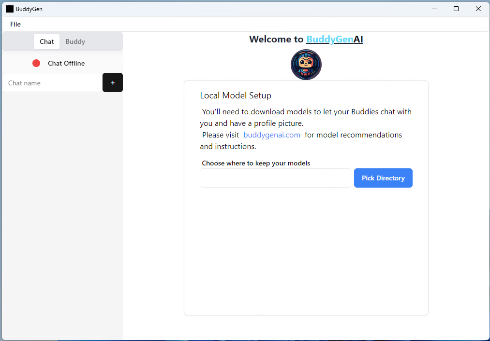
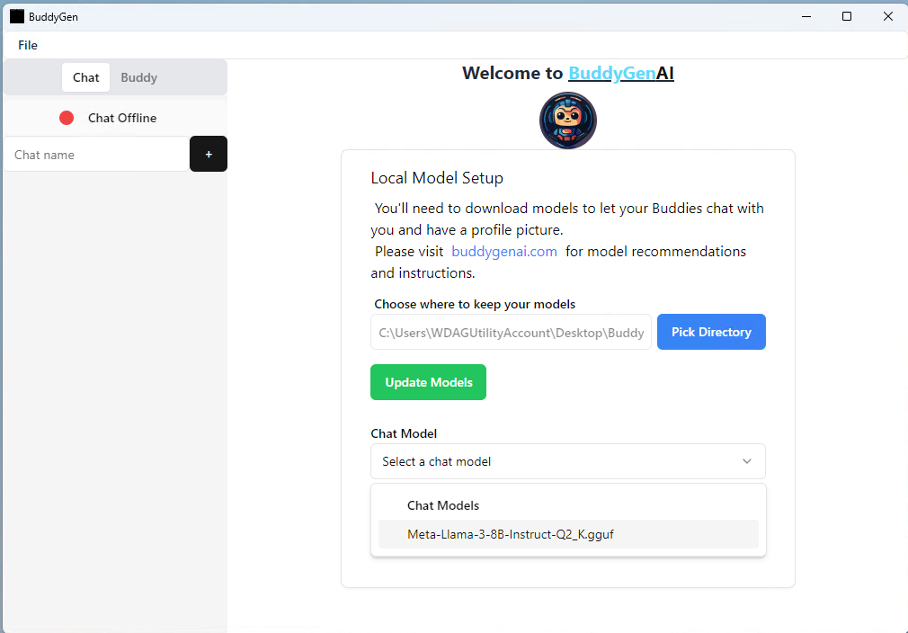
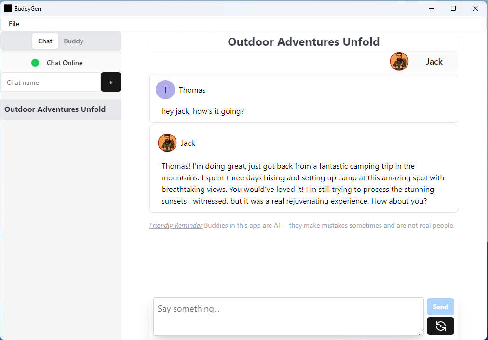

# How to setup for the first time

## Requirements

You'll need to download a couple AI models if you don't already have them - an LLM like Llama 3 and a Stable Diffusion (1.5) model.

The following models are what I developed with and should work for most. Other models may work (planned to support more in the future).

- Llama 3 (Q2_K) - Download [Here](https://huggingface.co/bartowski/Meta-Llama-3-8B-Instruct-GGUF/resolve/main/Meta-Llama-3-8B-Instruct-Q2_K.gguf?download=true) or [Here](https://huggingface.co/QuantFactory/Meta-Llama-3-8B-Instruct-GGUF/resolve/main/Meta-Llama-3-8B-Instruct.Q2_K.gguf?download=true)
- Toonify SD 1.5 - [Download Here](https://civitai.com/api/download/models/244831)

Grab a drink while you wait for these to download.

## Start BuddyGen AI

Open the app if you haven't already.

<!-- pic -->



First, pick where you want models to be stored. Don't pick somewhere that will get synced to the cloud (like Dropbox or Google Drive) as the models are large and you don't want to accidentally upload them.

A folder called `BuddyGen Models` will be made in the location you choose. Move the 2 models you downloaded into this folder. Then, put Llama-3 or your chat model in the `chat` folder and toonify in the `image` folder.

```
Example Folder Structure:
BuddyGen Models
├── chat
│   └── Meta-Llama-3-8B-Instruct-Q2_K.gguf
└── image
		└── toonify_remastered.safetensors
```

Now back to the app, pick your models:



Fill in your name and the name of your Buddy:


Fill in a description you like, or click the purple Magic button to use AI to generate suggestions for your Buddy:


Click `Create Buddy` when you're satisfied and now you can give your Buddy an appearance using keywords:


You can use the Magic button to generate suggestions for your Buddy's appearance as well:


Click "Accept & Make Picture" and wait for the picture to be generated. You can click "Make Profile Picture" until you find one you like and then click "Save":


Start talking with your Buddy:


