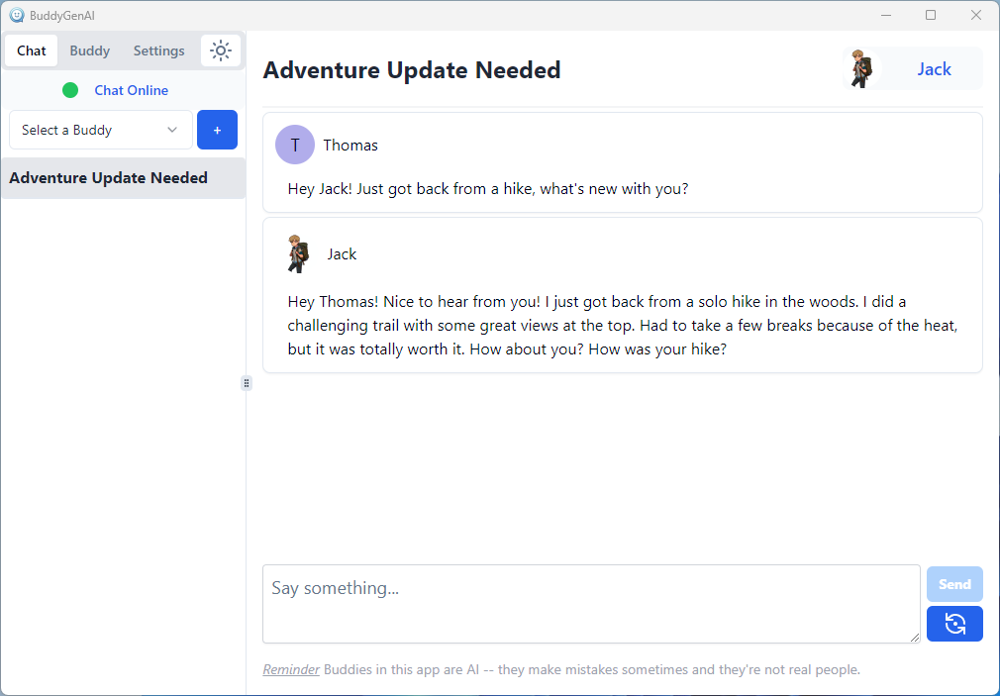

# Troubleshooting

- Try closing the app and opening it again

# How to setup for the first time

You can use BuddyGenAI using OpenAI's models or you can bring-your-own-models and run them on your own PC.

Open the app if you haven't already. You'll see the setup screen:

Do you want to use [OpenAI's models](#openai-models-setup) or [run your own](#local-models-setup)?

## OpenAI Models Setup

First, you'll need to [Sign Up](https://platform.openai.com/signup) or [Log In](https://platform.openai.com/login) to your OpenAI account.

Now go to the [API Keys](https://platform.openai.com/account/api-keys) page and click "Create new secret key". Give it a name if you want to and click "Create secret key". Now click Copy

## Local Models Setup

(**Experimental**) -- This feature is still in active development. If you run into any issues or have suggestions to improve anything, please [create a new issue](https://github.com/parsehex/BuddyGenAI/issues).

### Requirements

You should download and install the following before continuing:

- [Microsoft Visual C++ Redistributable x64](https://aka.ms/vs/17/release/vc_redist.x64.exe)
- (if you have NVIDIA GPU) [CUDA Toolkit](https://developer.nvidia.com/cuda-downloads)
- (if you have AMD GPU) [ROCm SDK](https://www.amd.com/en/developer/resources/rocm-hub/hip-sdk.html) -- not tested yet

You'll also need to download a couple AI models if you don't already have them - a chat model like Llama 3 and a Stable Diffusion (1.5) model.

The following are the models that I've mainly used while making the app. Support for more models will be added in the future.

The following are the models that I've been using while making the app (other may work as well), I've included links to download them from Hugging Face and Civitai for convenience.

Depending on how powerful your PC is, you can choose a model with a higher number (e.g. >=Q4_K) and you'll get better results. I don't have a good way to pick a good size at the moment, feel free to [reach out](https://github.com/parsehex/BuddyGenAI/discussions) if you need help.

You'll need to download a chat model (e.g. 1 of the Llama 3 links below) and an SD 1.5 image model (e.g. Toonify SD 1.5 below).

- Llama 3
  - Q2_K - This is a good one to start with
    - Download [Here](https://huggingface.co/bartowski/Meta-Llama-3-8B-Instruct-GGUF/resolve/main/Meta-Llama-3-8B-Instruct-Q2_K.gguf) or [Here](https://huggingface.co/QuantFactory/Meta-Llama-3-8B-Instruct-GGUF/resolve/main/Meta-Llama-3-8B-Instruct.Q2_K.gguf)
  - Q4_K
    - Download [Here](https://huggingface.co/bartowski/Meta-Llama-3-8B-Instruct-GGUF/resolve/main/Meta-Llama-3-8B-Instruct-Q4_K.gguf) or [Here](https://huggingface.co/QuantFactory/Meta-Llama-3-8B-Instruct-GGUF/resolve/main/Meta-Llama-3-8B-Instruct.Q4_K.gguf) or [Here](https://huggingface.co/QuantFactory/Meta-Llama-3-8B-Instruct-GGUF/resolve/main/Meta-Llama-3-8B-Instruct.Q4_K.gguf)
- Toonify SD 1.5 - [Download Here](https://civitai.com/api/download/models/244831)

### Move Models & Finish Setup

Now that you have the models downloaded, you'll need to move them to the correct location.

Open BuddyGenAI and click "Local Models" on the setup screen, then follow this gif:

- Click on Open Folder
- Go to Downloads (or wherever you saved the models)
- Select and right-click the model files you downloaded and click Cut (or Copy)
- Click the Back button to go back to the `Models` folder
- Right-click in the folder and click Paste
- Close the folder and click "Update Models" in the app
- Select the Chat Model and then the Image Model

---

Now you're ready to fill in your name and create your first Buddy:

Fill in a description you like, or click the purple Magic button to use AI to generate suggestions for your Buddy:

> Note: Magic buttons are not very fleshed out yet.

Click `Create Buddy` when you're satisfied.

---

Now you can describe your Buddy's appearance.

There's a Magic button to generate suggestions for your Buddy's appearance as well:

Click "Accept & Make Picture" and wait for the picture to be generated. You can click "Make Profile Picture" until you find one you like and then click "Save":

Start talking with your Buddy:

---

**Using a GPU?**

If you've followed the instructions so far then you'll need to do one more thing for the chat model to take advantage of your hardware.

Assuming you chose one of the Llama 3 models above, then go to the Settings tab:

Change "Number of GPU Layers" to 35.

Now either restart the app or go to the Chat tab, click on the (green) "Chat Online" to restart the chat manually:

